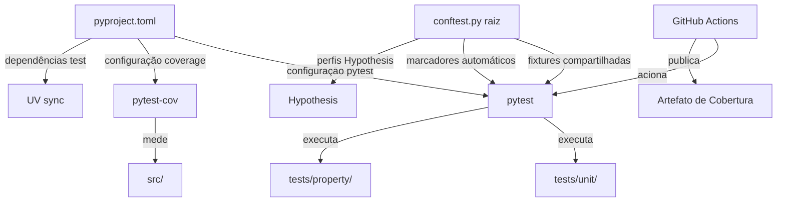
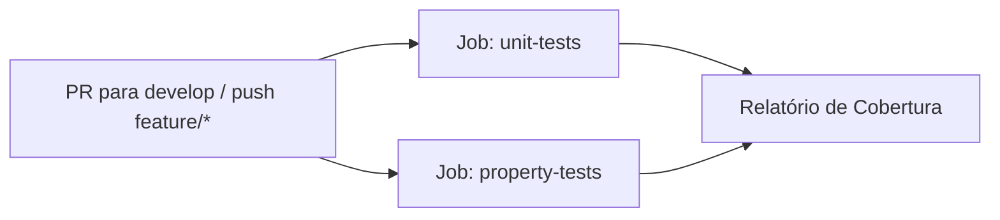

# Design — Configuração de Testes do Backend

## Visão Geral

Este design descreve a infraestrutura de configuração de testes para o backend do Semantic Log Explorer. O objetivo é centralizar a configuração do pytest, fornecer fixtures reutilizáveis, medir cobertura de código, permitir execução seletiva de testes por marcadores, declarar dependências de teste no `pyproject.toml`, configurar o Hypothesis com perfis padronizados e automatizar a execução via GitHub Actions.

Atualmente o projeto já possui testes unitários (`backend/tests/unit/`) e testes de propriedade (`backend/tests/property/`), mas cada arquivo de teste define suas próprias fixtures localmente (ex: `mock_settings`, `client`, `app` em `test_routes.py`), não existe `pyproject.toml` com configuração do pytest, não há medição de cobertura, e não existe pipeline de CI.

### Decisões de Design

| Decisão | Justificativa |
|---------|---------------|
| `pyproject.toml` como arquivo central | Padrão moderno do ecossistema Python (PEP 621), compatível com UV |
| `conftest.py` raiz em `backend/tests/` | Pytest descobre automaticamente fixtures sem imports explícitos |
| Marcadores automáticos via `conftest.py` | Evita decorar cada teste manualmente; usa o caminho do arquivo |
| `pytest-cov` para cobertura | Plugin padrão do ecossistema, integração nativa com pytest |
| Perfis do Hypothesis (`default`, `ci`, `dev`) | Permite ajustar `max_examples` por contexto de execução |
| Jobs separados no CI para unit e property | Feedback mais rápido; falha isolada facilita diagnóstico |

## Arquitetura

A infraestrutura de testes se organiza em camadas de configuração que interagem entre si:



### Estrutura de Arquivos

```
backend/
├── pyproject.toml                    # [NOVO] Configuração centralizada
├── .gitignore                        # [NOVO] Exclusões específicas do backend
├── tests/
│   ├── __init__.py                   # [EXISTENTE]
│   ├── conftest.py                   # [NOVO] Fixtures e marcadores compartilhados
│   ├── unit/
│   │   ├── __init__.py               # [EXISTENTE]
│   │   ├── conftest.py               # [NOVO] Marcador automático @unit
│   │   └── test_*.py                 # [EXISTENTE]
│   └── property/
│       ├── __init__.py               # [EXISTENTE]
│       ├── conftest.py               # [NOVO] Marcador automático @property
│       └── test_*.py                 # [EXISTENTE]
.github/
└── workflows/
    └── backend-tests.yml             # [NOVO] Pipeline de CI
```

## Componentes e Interfaces

### 1. `backend/pyproject.toml`

Arquivo central de configuração do projeto Python, contendo:

- **`[project]`**: Metadados do projeto (nome, versão, Python ≥ 3.10)
- **`[project.optional-dependencies]`**: Grupo `test` com dependências de teste
- **`[tool.pytest.ini_options]`**: Configuração do pytest (testpaths, verbosidade, marcadores, asyncio_mode)
- **`[tool.coverage.run]`**: Diretório-alvo (`src/`) e exclusões
- **`[tool.coverage.report]`**: Formatação e linhas excluídas da contagem

```toml
[project]
name = "semantic-log-explorer-backend"
version = "0.1.0"
requires-python = ">=3.10"

[project.optional-dependencies]
test = [
    "pytest>=8.0",
    "pytest-cov>=5.0",
    "pytest-asyncio>=0.24",
    "httpx>=0.27",
    "hypothesis>=6.100",
]

[tool.pytest.ini_options]
testpaths = ["tests"]
python_files = ["test_*.py"]
addopts = "-v"
asyncio_mode = "auto"
markers = [
    "unit: Testes unitários",
    "property: Testes baseados em propriedades (Hypothesis)",
    "integration: Testes de integração",
]

[tool.coverage.run]
source = ["src"]
omit = ["tests/*", "*/__pycache__/*", ".venv/*"]

[tool.coverage.report]
show_missing = true
exclude_lines = [
    "if __name__ == .__main__.",
    "pass",
    "\\.\\.\\.",
    "pragma: no cover",
]
```

### 2. `backend/tests/conftest.py` (Raiz)

Fixtures compartilhadas disponíveis para todos os testes:

| Fixture | Escopo | Descrição |
|---------|--------|-----------|
| `mock_settings` | `function` | Instância de `Settings` com `GOOGLE_API_KEY="test-key"` |
| `test_app` | `function` | Instância de `FastAPI` com rotas e dependências mockadas |
| `client` | `function` | `TestClient` síncrono para testes HTTP |
| `async_client` | `function` | `AsyncClient` (httpx) para testes assíncronos |

Também configura os perfis do Hypothesis:

| Perfil | `max_examples` | Ativação |
|--------|----------------|----------|
| `default` | 200 | Padrão local |
| `ci` | 500 | Automático quando `CI=true` |
| `dev` | 10 | Manual via `--hypothesis-profile=dev` |

### 3. `backend/tests/unit/conftest.py`

Hook `pytest_collection_modifyitems` que aplica automaticamente o marcador `@pytest.mark.unit` a todos os testes coletados neste diretório.

### 4. `backend/tests/property/conftest.py`

Hook `pytest_collection_modifyitems` que aplica automaticamente o marcador `@pytest.mark.property` a todos os testes coletados neste diretório.

### 5. `.github/workflows/backend-tests.yml`

Pipeline de CI com dois jobs paralelos:



| Job | Comando | Descrição |
|-----|---------|-----------|
| `unit-tests` | `pytest -m unit --cov --cov-report=term-missing --cov-report=html` | Executa testes unitários com cobertura |
| `property-tests` | `pytest -m property` | Executa testes de propriedade com perfil `ci` |

Ambos os jobs:
- Usam Python 3.12 e UV
- Definem `GOOGLE_API_KEY=test-key-for-ci` como variável de ambiente
- Definem `CI=true` (padrão do GitHub Actions)

O job `unit-tests` publica o relatório HTML de cobertura como artefato.

## Modelos de Dados

Esta feature não introduz novos modelos de dados. Os modelos existentes (`Settings`, `Chunk`, `ChunkMetadata`, `LogLevel`, etc.) são reutilizados nas fixtures.

### Configuração do Hypothesis (Modelo de Perfis)

```python
# Perfis registrados no conftest.py raiz
from hypothesis import settings, HealthCheck

settings.register_profile("default", max_examples=200)
settings.register_profile("ci", max_examples=500, suppress_health_check=[HealthCheck.too_slow])
settings.register_profile("dev", max_examples=10)
```

### Estrutura do Workflow YAML (Modelo Conceitual)

```yaml
on:
  pull_request:
    branches: [develop]
  push:
    branches: [feature/*]

jobs:
  unit-tests:
    runs-on: ubuntu-latest
    steps: [checkout, setup-python, install-uv, sync, pytest -m unit --cov]
  
  property-tests:
    runs-on: ubuntu-latest
    steps: [checkout, setup-python, install-uv, sync, pytest -m property]
```


## Propriedades de Corretude

*Uma propriedade é uma característica ou comportamento que deve ser verdadeiro em todas as execuções válidas de um sistema — essencialmente, uma declaração formal sobre o que o sistema deve fazer. Propriedades servem como ponte entre especificações legíveis por humanos e garantias de corretude verificáveis por máquina.*

### Propriedade 1: Marcador unit aplicado automaticamente a testes unitários

*Para qualquer* teste coletado pelo pytest a partir do diretório `tests/unit/`, esse teste deve possuir o marcador `unit`, e quando o pytest é executado com `-m unit`, apenas testes do diretório `tests/unit/` devem ser coletados.

**Valida: Requisitos 4.1, 4.3**

### Propriedade 2: Marcador property aplicado automaticamente a testes de propriedade

*Para qualquer* teste coletado pelo pytest a partir do diretório `tests/property/`, esse teste deve possuir o marcador `property`, e quando o pytest é executado com `-m property`, apenas testes do diretório `tests/property/` devem ser coletados.

**Valida: Requisitos 4.2, 4.4**

### Propriedade 3: Fixture mock_settings retorna Settings válida

*Para qualquer* invocação da fixture `mock_settings`, o objeto retornado deve ser uma instância válida de `Settings` com `GOOGLE_API_KEY` não-vazio, `ALLOWED_EXTENSIONS` não-vazio e `MAX_FILE_SIZE_MB` maior que zero.

**Valida: Requisitos 2.2**

### Propriedade 4: Dependências de teste completas e versionadas

*Para qualquer* pacote no conjunto obrigatório `{pytest, pytest-cov, pytest-asyncio, httpx, hypothesis}`, esse pacote deve estar presente no grupo de dependências de teste do `pyproject.toml` e deve incluir um especificador de versão mínima (ex: `>=X.Y`).

**Valida: Requisitos 5.2, 5.3**

### Propriedade 5: Perfis do Hypothesis com max_examples correto

*Para qualquer* perfil registrado do Hypothesis no mapeamento `{default: 200, ci: 500, dev: 10}`, o valor de `max_examples` do perfil deve corresponder ao valor esperado.

**Valida: Requisitos 7.1, 7.2, 7.3**

## Tratamento de Erros

| Cenário | Comportamento Esperado |
|---------|----------------------|
| `pyproject.toml` com sintaxe TOML inválida | UV e pytest reportam erro de parsing com linha/coluna |
| Fixture `mock_settings` falha ao criar `Settings` | Pytest reporta erro na fixture com traceback completo |
| `pytest-cov` não instalado ao rodar `--cov` | Pytest exibe erro claro: "no module named pytest_cov" |
| Variável `GOOGLE_API_KEY` ausente no CI | Testes de `test_config.py` que dependem da variável falham com `ValidationError` |
| Hypothesis atinge deadline em testes de propriedade | Perfil `ci` suprime `HealthCheck.too_slow`; perfil `dev` usa poucos exemplos |
| Job do CI falha | GitHub Actions reporta status de falha no PR automaticamente |

## Estratégia de Testes

### Abordagem Dual

A estratégia combina testes unitários (exemplos específicos) e testes baseados em propriedades (verificação universal):

- **Testes unitários**: Verificam exemplos concretos, casos de borda e condições de erro da configuração
- **Testes de propriedade**: Verificam propriedades universais que devem valer para todas as entradas

### Testes Unitários

Focados em verificações pontuais da infraestrutura:

- Verificar que `pyproject.toml` contém as seções `[tool.pytest.ini_options]` e `[tool.coverage.run]`
- Verificar que `conftest.py` raiz define as fixtures `mock_settings`, `test_app`, `client` e `async_client`
- Verificar que `test_app` retorna uma instância de `FastAPI` com rotas `/api/upload` e `/api/chat`
- Verificar que `client` retorna um `TestClient` funcional
- Verificar que o workflow YAML define triggers para `pull_request` em `develop` e `push` em `feature/*`
- Verificar que o workflow define `GOOGLE_API_KEY` como variável de ambiente
- Verificar que `.gitignore` do backend inclui `htmlcov/` e `.hypothesis/`
- Verificar que quando `CI=true`, o perfil ativo do Hypothesis é `ci`

### Testes Baseados em Propriedades

Cada propriedade de corretude deve ser implementada por um único teste baseado em propriedades usando a biblioteca **Hypothesis**. Configuração mínima de 100 iterações por teste.

| Propriedade | Tag do Teste |
|-------------|-------------|
| Propriedade 1 | `Feature: backend-test-configuration, Property 1: Marcador unit aplicado automaticamente a testes unitários` |
| Propriedade 2 | `Feature: backend-test-configuration, Property 2: Marcador property aplicado automaticamente a testes de propriedade` |
| Propriedade 3 | `Feature: backend-test-configuration, Property 3: Fixture mock_settings retorna Settings válida` |
| Propriedade 4 | `Feature: backend-test-configuration, Property 4: Dependências de teste completas e versionadas` |
| Propriedade 5 | `Feature: backend-test-configuration, Property 5: Perfis do Hypothesis com max_examples correto` |

### Biblioteca de Testes de Propriedade

- **Biblioteca**: Hypothesis (já utilizada no projeto)
- **Configuração**: Mínimo 100 iterações por teste de propriedade
- **Perfis**: `default` (200), `ci` (500), `dev` (10)
- **Cada teste de propriedade DEVE** referenciar a propriedade do design via comentário no formato de tag acima
