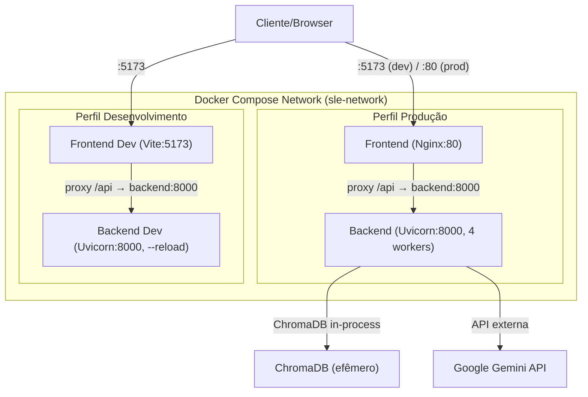
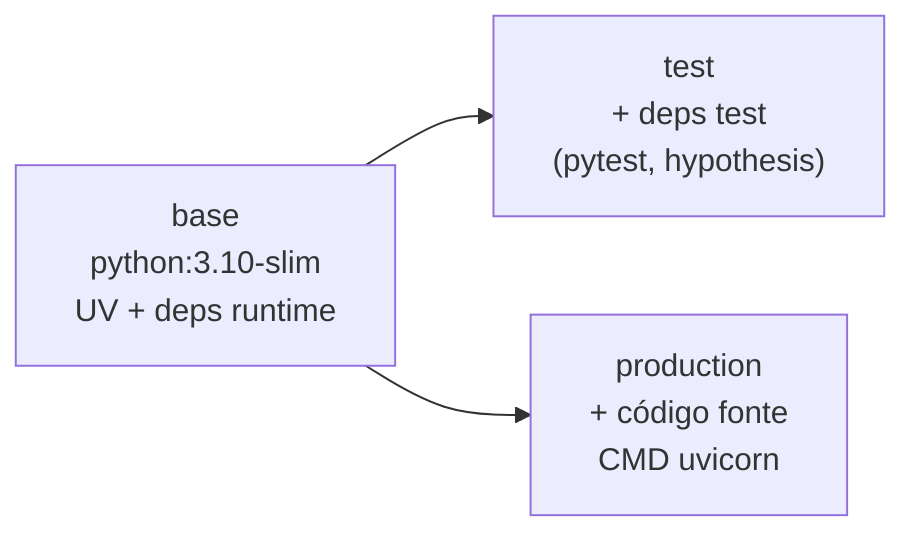
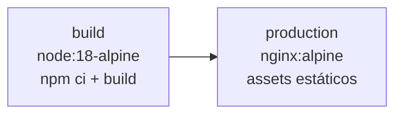
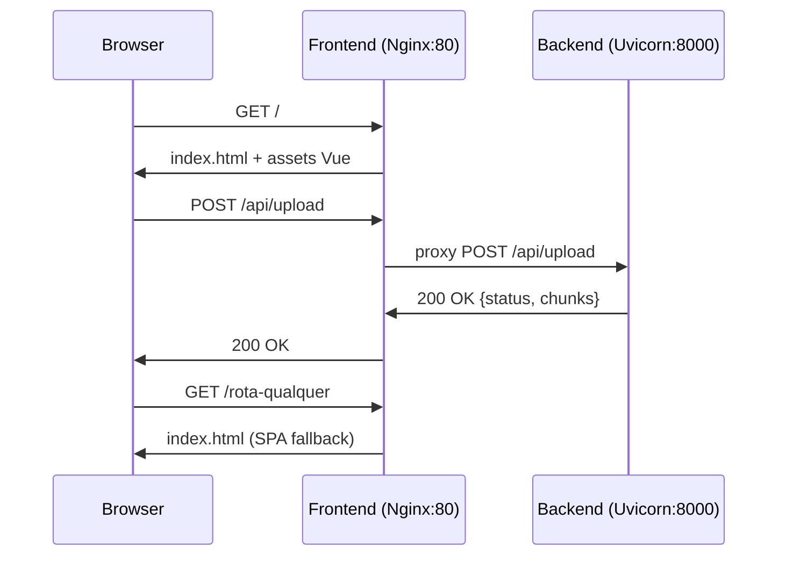

# Documento de Design — Docker e Integração

## Visão Geral

Este design descreve a abordagem técnica para evoluir a infraestrutura Docker do Semantic Log Explorer de uma configuração básica de desenvolvimento para uma solução pronta para produção. A estratégia central é utilizar multi-stage builds para ambos os serviços (Backend e Frontend), orquestração via Docker Compose com health checks, perfis separados para dev/prod e Nginx como servidor de produção do Frontend com proxy reverso para a API.

### Estado Atual

- Dockerfile único e básico para o Backend (single-stage, sem separação de dependências de teste)
- Frontend roda via `node:18-alpine` com `npm install` a cada inicialização
- Docker Compose sem health checks, rede dedicada ou perfis
- Sem configuração Nginx para produção

### Estado Desejado

- Dockerfile multi-estágio para Backend (base → test → production)
- Dockerfile multi-estágio para Frontend (build → production com Nginx)
- Docker Compose com rede bridge customizada, health checks, `env_file` e perfis dev/prod
- Nginx configurado com proxy reverso `/api` → Backend e fallback SPA

## Arquitetura



### Estrutura de Arquivos Docker

```
project-root/
├── Dockerfile                  # Multi-stage Backend (base, test, production)
├── docker-compose.yml          # Orquestração com perfis dev/prod
├── frontend/
│   ├── Dockerfile              # Multi-stage Frontend (build, production)
│   └── nginx.conf              # Configuração Nginx (proxy reverso + SPA)
├── backend/
│   ├── .env                    # Variáveis de ambiente (não versionado)
│   └── .env.example            # Template de variáveis
```

### Decisões de Design

| Decisão | Justificativa |
|---------|---------------|
| Dockerfile Backend na raiz | O `pyproject.toml` referencia `backend.src` como módulo, então o contexto de build precisa ser a raiz do projeto |
| Dockerfile Frontend em `frontend/` | O contexto de build é autocontido no diretório `frontend/` |
| Nginx Alpine | Imagem mínima (~5MB) para servir assets estáticos |
| Rede bridge customizada | Permite resolução DNS por nome de serviço (`backend`, `frontend`) |
| UV para gerenciamento de deps | Já utilizado no projeto, resolução rápida e reprodutível |
| Perfis Docker Compose | Evita manter dois arquivos compose separados |

## Componentes e Interfaces

### 1. Dockerfile Backend (`./Dockerfile`)

Três estágios:

**Estágio `base`**: Instala UV, copia `pyproject.toml` e `uv.lock`, executa `uv sync` para dependências de runtime.

**Estágio `test`**: Herda de `base`, instala dependências do grupo `test` via `uv sync --group test`. Usado para CI/CD.

**Estágio `production`**: Herda de `base`, copia código-fonte, expõe porta 8000, define CMD com Uvicorn (4 workers).



### 2. Dockerfile Frontend (`./frontend/Dockerfile`)

Dois estágios:

**Estágio `build`**: Usa `node:18-alpine`, executa `npm ci` e `npm run build`. Aceita `VITE_API_URL` como `ARG`.

**Estágio `production`**: Usa `nginx:alpine`, copia assets do estágio build para `/usr/share/nginx/html`, copia `nginx.conf` customizado, expõe porta 80.



### 3. Configuração Nginx (`./frontend/nginx.conf`)

- Escuta na porta 80
- Serve arquivos estáticos de `/usr/share/nginx/html`
- Proxy reverso: `/api` → `http://backend:8000`
- Fallback SPA: qualquer rota não encontrada retorna `index.html`
- Headers de proxy: `X-Real-IP`, `X-Forwarded-For`, `X-Forwarded-Proto`, `Host`

### 4. Docker Compose (`./docker-compose.yml`)

**Serviços:**

| Serviço | Imagem/Build | Portas | Health Check |
|---------|-------------|--------|-------------|
| `backend` | Build de `./Dockerfile` target `production` | 8000:8000 | `curl http://localhost:8000/health` |
| `frontend` | Build de `./frontend/Dockerfile` | 5173:80 (prod) | `curl http://localhost:80/` |
| `backend-dev` | Build de `./Dockerfile` target `base` | 8000:8000 | Mesmo do backend |
| `frontend-dev` | `node:18-alpine` com volumes | 5173:5173 | `curl http://localhost:5173/` |

**Rede:** `sle-network` (bridge customizada)

**Perfis:**
- `prod`: serviços `backend` e `frontend`
- `dev`: serviços `backend-dev` e `frontend-dev`

### 5. Interface entre Componentes



## Modelos de Dados

### Variáveis de Ambiente

**Backend (`backend/.env`):**

| Variável | Obrigatória | Padrão | Descrição |
|----------|-------------|--------|-----------|
| `GOOGLE_API_KEY` | Sim | — | Chave da API Google Gemini |
| `CHROMA_COLLECTION_NAME` | Não | `log_chunks` | Nome da coleção ChromaDB |
| `MAX_FILE_SIZE_MB` | Não | `50` | Tamanho máximo de upload |
| `ALLOWED_EXTENSIONS` | Não | `.log,.txt,.json` | Extensões permitidas |

**Frontend (build-time):**

| Variável | Obrigatória | Padrão | Descrição |
|----------|-------------|--------|-----------|
| `VITE_API_URL` | Não | `/api` | URL base da API (em produção, relativa via Nginx) |

### Health Check Response

```json
{
  "status": "ok"
}
```

Endpoint já existente em `backend/src/main.py`: `GET /health`

### Configuração Docker Compose — Estrutura Lógica

```yaml
# Estrutura lógica (não é o arquivo final)
services:
  backend:        # prod profile, target: production
  frontend:       # prod profile, build: frontend/Dockerfile
  backend-dev:    # dev profile, target: base, volumes montados, --reload
  frontend-dev:   # dev profile, node:18-alpine, npm run dev, volumes montados

networks:
  sle-network:
    driver: bridge
```

## Propriedades de Corretude

*Uma propriedade é uma característica ou comportamento que deve ser verdadeiro em todas as execuções válidas de um sistema — essencialmente, uma declaração formal sobre o que o sistema deve fazer. Propriedades servem como ponte entre especificações legíveis por humanos e garantias de corretude verificáveis por máquina.*

A maioria dos critérios de aceitação desta feature são verificações estruturais em arquivos de configuração (Dockerfiles, docker-compose.yml, nginx.conf). Estes são melhor validados como testes de exemplo/unitários que inspecionam o conteúdo dos arquivos. As propriedades abaixo capturam os comportamentos universais que devem valer para qualquer entrada.

### Propriedade 1: Ausência de valores sensíveis nas imagens Docker

*Para qualquer* instrução `ENV` ou `ARG` com valor padrão no Dockerfile do Backend, o valor não deve conter chaves de API, senhas ou tokens. Especificamente, nenhuma instrução deve conter valores que correspondam a padrões de credenciais (ex: strings longas alfanuméricas, prefixos como `sk-`, `AIza`, etc.).

**Valida: Requisito 5.3**

### Propriedade 2: Proxy reverso Nginx para rotas /api

*Para qualquer* requisição HTTP cujo path comece com `/api`, a configuração Nginx deve encaminhá-la ao serviço Backend na porta 8000 via `proxy_pass`. Isso garante que nenhuma rota `/api` seja tratada como arquivo estático.

**Valida: Requisito 7.2**

### Propriedade 3: Fallback SPA para rotas não-estáticas

*Para qualquer* URL que não corresponda a um arquivo estático existente em `/usr/share/nginx/html`, a configuração Nginx deve retornar `index.html`. Isso garante que o Vue Router funcione corretamente com navegação client-side.

**Valida: Requisito 7.3**

## Tratamento de Erros

### Cenários de Erro e Mitigações

| Cenário | Mitigação |
|---------|-----------|
| `backend/.env` não existe | Docker Compose falha no startup com erro claro. Documentar no README que o arquivo deve ser criado a partir de `.env.example` |
| Backend não responde ao health check | Docker Compose marca como `unhealthy`, Frontend não inicia (depends_on com condition: service_healthy) |
| Frontend não responde ao health check | Docker Compose marca como `unhealthy`, logs disponíveis via `docker compose logs frontend` |
| Porta 8000 ou 5173 já em uso no host | Docker falha com erro de bind. Usuário deve liberar a porta ou alterar o mapeamento |
| Build do Frontend falha (npm ci) | Erro visível no output do build. Verificar `package-lock.json` e dependências |
| VITE_API_URL não fornecida | Valor padrão `/api` é usado (relativo, funciona com Nginx proxy) |
| ChromaDB falha ao inicializar | Backend retorna erro 500. Health check detecta e marca como unhealthy |

### Estratégia de Logs

- Backend: logs do Uvicorn disponíveis via `docker compose logs backend`
- Frontend (prod): logs do Nginx em `/var/log/nginx/` e via `docker compose logs frontend`
- Frontend (dev): logs do Vite via `docker compose logs frontend-dev`

## Estratégia de Testes

### Abordagem Dual: Testes Unitários + Testes Baseados em Propriedades

Esta feature envolve primariamente arquivos de configuração (Dockerfiles, docker-compose.yml, nginx.conf). A estratégia de testes combina:

1. **Testes unitários/exemplo**: Verificações estruturais nos arquivos de configuração (a maioria dos critérios de aceitação)
2. **Testes baseados em propriedades**: Validação de comportamentos universais (propriedades de corretude)

### Testes Unitários (Exemplos e Edge Cases)

Testes que verificam a estrutura dos arquivos de configuração:

- **Dockerfile Backend**: Verificar 3 estágios (base, test, production), imagem base `python:3.10-slim`, WORKDIR `/app`, EXPOSE 8000, presença de `uv sync`, ausência de COPY de deps de teste no estágio production
- **Dockerfile Frontend**: Verificar 2 estágios (build, production), imagem `node:18-alpine` no build, `nginx:alpine` na production, ARG `VITE_API_URL`, EXPOSE 80
- **Docker Compose**: Verificar rede bridge customizada, build contexts corretos, depends_on com service_healthy, mapeamento de portas, env_file, health checks com parâmetros corretos (interval 10s, timeout 5s, retries 3), perfis dev/prod, volumes no dev, comandos corretos por perfil
- **Nginx.conf**: Verificar listen 80, root `/usr/share/nginx/html`, location `/api` com proxy_pass, try_files com fallback para index.html
- **Edge case**: Verificar que `backend/.env` ausente gera erro claro

### Testes Baseados em Propriedades

Biblioteca: **Hypothesis** (Python, já configurada no projeto)

Configuração: mínimo 100 iterações por teste de propriedade.

Cada teste deve ser anotado com comentário referenciando a propriedade do design:

- **Feature: docker-integration, Property 1: Ausência de valores sensíveis nas imagens Docker** — Gerar strings aleatórias simulando instruções Dockerfile e verificar que o validador detecta corretamente valores sensíveis vs. seguros
- **Feature: docker-integration, Property 2: Proxy reverso Nginx para rotas /api** — Gerar paths aleatórios começando com `/api` e verificar que a lógica de roteamento Nginx os encaminha ao backend
- **Feature: docker-integration, Property 3: Fallback SPA para rotas não-estáticas** — Gerar paths aleatórios que não correspondem a arquivos estáticos e verificar que o fallback para `index.html` é ativado

### Testes de Integração (Manuais)

Validações que requerem Docker em execução (não automatizáveis em CI sem Docker-in-Docker):

- `docker compose --profile prod up --build` inicia ambos os serviços
- `docker compose --profile dev up --build` inicia serviços de desenvolvimento
- Health checks passam após startup
- Requisição `GET /health` retorna `{"status": "ok"}`
- Requisição `POST /api/upload` via Nginx chega ao Backend
- Rota `/qualquer-coisa` retorna `index.html` (SPA fallback)
