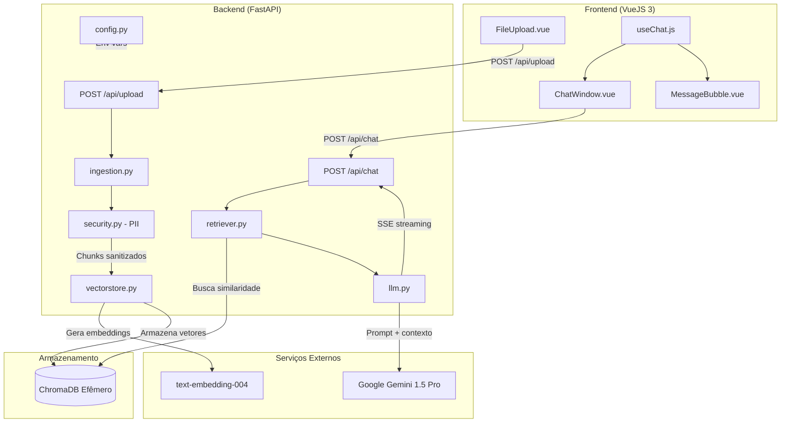
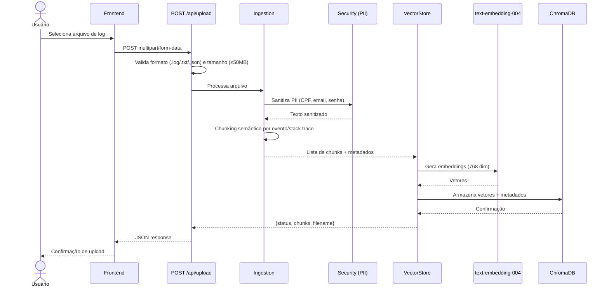
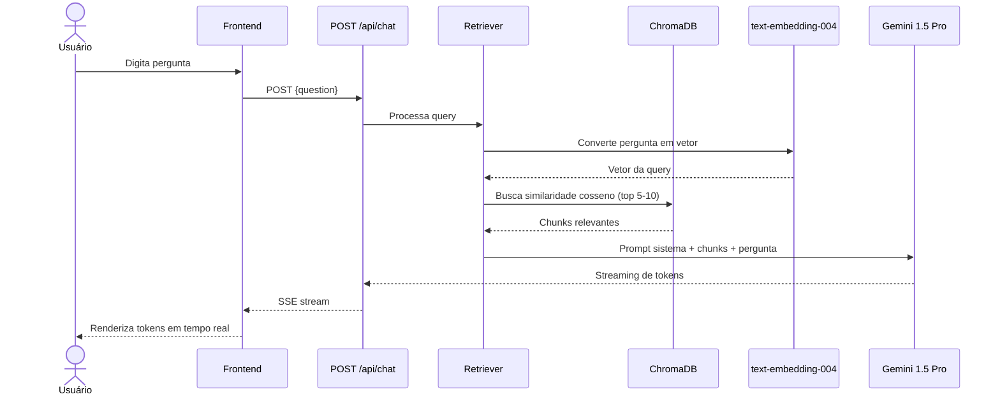

# Design — Semantic Log Explorer

## Visão Geral

O Semantic Log Explorer é uma aplicação full-stack de observabilidade inteligente que utiliza uma arquitetura RAG (Retrieval-Augmented Generation) para permitir análise semântica de logs via linguagem natural. O sistema é composto por:

- **Backend (FastAPI)**: Recebe uploads de logs, executa o pipeline RAG (limpeza → sanitização PII → chunking → vetorização → recuperação → geração) e expõe endpoints REST com streaming SSE.
- **Frontend (VueJS 3)**: Interface de chat minimalista com upload de arquivos e renderização de respostas em tempo real com suporte a Markdown.
- **ChromaDB**: Banco vetorial local e efêmero para armazenamento de embeddings.
- **Google Gemini 1.5 Pro**: LLM utilizado para geração de respostas contextualizadas.

O fluxo principal é: o usuário faz upload de um arquivo de log → o backend processa, sanitiza e vetoriza → o usuário faz perguntas em linguagem natural → o sistema recupera chunks relevantes e gera respostas via streaming.

## Arquitetura

### Diagrama de Componentes



### Fluxo de Dados — Ingestão



### Fluxo de Dados — Chat RAG



## Componentes e Interfaces

### Backend

#### `core/config.py` — Configuração
- Classe `Settings` usando Pydantic `BaseSettings` para carregar variáveis de ambiente
- Campos: `GOOGLE_API_KEY` (obrigatório), `CHROMA_COLLECTION_NAME`, `MAX_FILE_SIZE_MB`, `ALLOWED_EXTENSIONS`
- Validação na inicialização: falha se `GOOGLE_API_KEY` não estiver definida

#### `core/security.py` — Sanitização de PII
- Função `sanitize_pii(text: str) -> str`
- Padrões Regex para: CPF (`\d{3}\.\d{3}\.\d{3}-\d{2}`), e-mail, senhas em formatos comuns
- Substitui por marcadores: `[CPF_MASCARADO]`, `[EMAIL_MASCARADO]`, `[SENHA_MASCARADA]`

#### `services/ingestion.py` — Ingestão e Chunking
- Função `process_file(file: UploadFile) -> list[Chunk]`
- Limpeza de ruído (timestamps irrelevantes, IDs de sessão únicos)
- Chunking semântico: divide por eventos/stack traces completos
- Cada chunk contém: `text`, `metadata` (filename, timestamp, log_level)

#### `services/vectorstore.py` — Interface ChromaDB
- Classe `VectorStoreService` com ChromaDB client efêmero
- Métodos: `add_chunks(chunks)`, `search(query_embedding, top_k)`, `clear_collection()`
- Gera embeddings via `text-embedding-004` do Google (768 dimensões)
- Armazena metadados: `filename`, `timestamp`, `log_level`

#### `services/retriever.py` — Busca Semântica
- Função `retrieve(question: str, top_k: int = 5) -> list[Chunk]`
- Converte a pergunta em vetor usando o mesmo modelo de embeddings
- Busca por similaridade de cosseno no ChromaDB
- Retorna os chunks mais relevantes com metadados

#### `services/llm.py` — Integração Gemini
- Classe `LLMService` com prompt de sistema especializado (SRE Senior)
- Método `generate_stream(question: str, context_chunks: list[Chunk]) -> AsyncGenerator[str]`
- Monta prompt com contexto dos chunks recuperados
- Retorna tokens via streaming assíncrono
- Instrui o modelo a não especular quando não houver dados suficientes

#### `api/routes/upload.py` — Rota de Upload
- `POST /api/upload`: Recebe `UploadFile`
- Validações: formato (.log, .txt, .json), tamanho (≤50MB)
- Retorna: `{"status": "indexed", "chunks": N, "filename": "app.log"}`

#### `api/routes/chat.py` — Rota de Chat
- `POST /api/chat`: Recebe `{"question": "..."}`
- Retorna: `StreamingResponse` com `text/event-stream`
- Orquestra: retriever → LLM → SSE

#### `api/dependencies.py` — Injeção de Dependências
- Providers para `VectorStoreService`, `LLMService`, `Settings`
- Gerenciamento de ciclo de vida do ChromaDB client

#### `models/schemas.py` — Modelos Pydantic
- `UploadResponse`: status, chunks, filename
- `ChatRequest`: question
- `ChunkMetadata`: filename, timestamp, log_level
- `Chunk`: text, metadata

### Frontend

#### `components/FileUpload.vue`
- Componente de upload com drag-and-drop
- Aceita .log, .txt, .json
- Exibe progresso e confirmação (nome do arquivo + quantidade de chunks)
- Exibe mensagens de erro descritivas em caso de falha

#### `components/ChatWindow.vue`
- Área de conversa com scroll automático
- Campo de entrada de texto para perguntas
- Gerencia estado de loading durante streaming

#### `components/MessageBubble.vue`
- Renderiza mensagens do usuário e da IA
- Suporte a Markdown com blocos de código formatados
- Diferenciação visual entre mensagens do usuário e do sistema

#### `composables/useChat.js`
- Composable para lógica de comunicação com a API
- Gerencia estado: mensagens, loading, erro
- Implementa consumo de SSE para streaming de respostas
- Métodos: `sendMessage(question)`, `clearChat()`

## Modelos de Dados

### Backend — Pydantic Schemas

```python
from pydantic import BaseModel, Field
from typing import Optional
from enum import Enum

class LogLevel(str, Enum):
    DEBUG = "DEBUG"
    INFO = "INFO"
    WARNING = "WARNING"
    ERROR = "ERROR"
    CRITICAL = "CRITICAL"
    UNKNOWN = "UNKNOWN"

class ChunkMetadata(BaseModel):
    filename: str
    timestamp: Optional[str] = None
    log_level: LogLevel = LogLevel.UNKNOWN

class Chunk(BaseModel):
    text: str
    metadata: ChunkMetadata

class UploadResponse(BaseModel):
    status: str = "indexed"
    chunks: int
    filename: str

class ChatRequest(BaseModel):
    question: str = Field(..., min_length=1, max_length=2000)

class ErrorResponse(BaseModel):
    detail: str
```

### ChromaDB — Estrutura de Armazenamento

| Campo | Tipo | Descrição |
|-------|------|-----------|
| `id` | string | UUID gerado para cada chunk |
| `embedding` | float[768] | Vetor gerado pelo text-embedding-004 |
| `document` | string | Texto do chunk sanitizado |
| `metadata` | dict | `{filename, timestamp, log_level}` |

### Frontend — Estado do Chat

```typescript
interface Message {
  id: string
  role: 'user' | 'assistant'
  content: string
  timestamp: Date
  isStreaming: boolean
}

interface ChatState {
  messages: Message[]
  isLoading: boolean
  error: string | null
  uploadedFile: { filename: string, chunks: number } | null
}
```


## Propriedades de Corretude

*Uma propriedade é uma característica ou comportamento que deve ser verdadeiro em todas as execuções válidas de um sistema — essencialmente, uma declaração formal sobre o que o sistema deve fazer. Propriedades servem como ponte entre especificações legíveis por humanos e garantias de corretude verificáveis por máquina.*

### Propriedade 1: Validação de formato de arquivo

*Para qualquer* arquivo enviado ao endpoint POST /api/upload, o arquivo deve ser aceito se e somente se sua extensão estiver em {.log, .txt, .json}. Arquivos com extensões fora desse conjunto devem retornar HTTP 400.

**Valida: Requisitos 1.1, 1.2**

### Propriedade 2: Chunking preserva stack traces completos

*Para qualquer* arquivo de log contendo stack traces, após o chunking semântico, cada stack trace deve estar contido integralmente em um único chunk, sem ser dividido entre chunks diferentes.

**Valida: Requisito 1.6**

### Propriedade 3: Resposta de upload contém campos obrigatórios

*Para qualquer* arquivo válido processado com sucesso pelo endpoint de upload, a resposta JSON deve conter os campos `status` (igual a "indexed"), `chunks` (inteiro ≥ 1) e `filename` (string não vazia igual ao nome do arquivo enviado).

**Valida: Requisito 1.5**

### Propriedade 4: Vetorização produz embeddings e metadados corretos

*Para qualquer* chunk gerado pelo módulo de ingestão, após vetorização, o embedding armazenado no ChromaDB deve ter exatamente 768 dimensões e os metadados devem conter os campos `filename`, `timestamp` e `log_level`.

**Valida: Requisitos 2.1, 2.2**

### Propriedade 5: Sanitização de PII remove todos os dados sensíveis

*Para qualquer* texto contendo padrões de PII (CPFs no formato XXX.XXX.XXX-XX, endereços de e-mail, ou senhas), após a sanitização, o texto resultante não deve conter nenhum dado sensível em texto claro e deve conter os marcadores correspondentes (`[CPF_MASCARADO]`, `[EMAIL_MASCARADO]`, `[SENHA_MASCARADA]`).

**Valida: Requisitos 7.1, 7.3, 7.4**

### Propriedade 6: Retriever retorna quantidade limitada de resultados

*Para qualquer* pergunta enviada ao retriever com dados indexados no ChromaDB, o número de chunks retornados deve estar entre 1 e 10 (inclusive), respeitando o parâmetro `top_k`.

**Valida: Requisito 3.3**

### Propriedade 7: Montagem do prompt inclui papel e contexto

*Para qualquer* conjunto de chunks recuperados e uma pergunta do usuário, o prompt montado pelo Serviço_LLM deve conter a instrução de papel (Engenheiro de SRE Senior) e o texto de todos os chunks fornecidos como contexto.

**Valida: Requisitos 12.1, 12.2**

### Propriedade 8: Limpeza de sessão remove todos os dados

*Para qualquer* coleção no ChromaDB com dados armazenados, após a execução da limpeza de sessão, a coleção deve estar vazia (zero documentos).

**Valida: Requisito 8.3**

### Propriedade 9: Resposta de chat utiliza formato SSE

*Para qualquer* resposta do endpoint POST /api/chat, o content-type deve ser `text/event-stream` e os dados devem seguir o formato SSE (prefixo `data:` em cada evento).

**Valida: Requisito 9.1**

## Tratamento de Erros

### Backend

| Cenário | Código HTTP | Resposta | Componente |
|---------|-------------|----------|------------|
| Formato de arquivo inválido | 400 | `{"detail": "Formato não suportado. Use .log, .txt ou .json"}` | upload.py |
| Arquivo excede 50MB | 413 | `{"detail": "Arquivo excede o limite de 50MB"}` | upload.py |
| Arquivo vazio | 400 | `{"detail": "Arquivo vazio"}` | upload.py |
| Pergunta vazia no chat | 422 | Validação Pydantic automática | chat.py |
| GOOGLE_API_KEY ausente | Falha na inicialização | `ValueError` com mensagem descritiva | config.py |
| Erro na API do Gemini | 502 | `{"detail": "Erro ao comunicar com o serviço de IA"}` | llm.py |
| Erro na geração de embeddings | 502 | `{"detail": "Erro ao gerar embeddings"}` | vectorstore.py |
| ChromaDB indisponível | 503 | `{"detail": "Serviço de armazenamento vetorial indisponível"}` | vectorstore.py |
| Nenhum chunk indexado (chat sem upload) | 400 | `{"detail": "Nenhum log indexado. Faça upload de um arquivo primeiro"}` | chat.py |
| Erro interno inesperado | 500 | `{"detail": "Erro interno do servidor"}` | middleware |

### Frontend

| Cenário | Comportamento |
|---------|---------------|
| Erro no upload | Exibe mensagem de erro descritiva ao usuário |
| Erro no chat | Exibe mensagem de erro na área de conversa |
| Conexão SSE interrompida | Exibe mensagem de erro e permite reenvio |
| Backend indisponível | Exibe mensagem de conexão falhou |

### Estratégia de Logging

- Erros de API externa (Gemini, embeddings) são logados com nível ERROR
- Erros de validação de input são logados com nível WARNING
- Operações normais (upload, chat) são logadas com nível INFO

## Estratégia de Testes

### Abordagem Dual: Testes Unitários + Testes Baseados em Propriedades

O projeto utiliza uma abordagem complementar de testes:

- **Testes unitários**: Verificam exemplos específicos, edge cases e condições de erro
- **Testes baseados em propriedades**: Verificam propriedades universais com inputs gerados aleatoriamente

### Bibliotecas

- **Backend**: `pytest` + `hypothesis` (property-based testing) + `pytest-asyncio` + `httpx` (async test client)
- **Frontend**: `vitest` + `fast-check` (property-based testing) + `@vue/test-utils`

### Testes Unitários (Exemplos e Edge Cases)

| Componente | Teste | Tipo |
|------------|-------|------|
| config.py | Falha na inicialização sem GOOGLE_API_KEY | Exemplo |
| config.py | Carrega configurações do .env corretamente | Exemplo |
| upload.py | Rejeita arquivo > 50MB com HTTP 413 | Edge case |
| upload.py | Rejeita arquivo vazio | Edge case |
| ingestion.py | Processa arquivo .json com estrutura válida | Exemplo |
| vectorstore.py | ChromaDB opera em modo efêmero | Exemplo |
| vectorstore.py | Limpeza de coleção remove todos os documentos | Exemplo |
| chat.py | Rejeita pergunta quando nenhum log está indexado | Edge case |
| llm.py | Prompt contém instrução de formatação Markdown | Exemplo |
| llm.py | Prompt contém instrução contra especulação | Exemplo |
| FileUpload.vue | Renderiza componente de upload | Exemplo |
| FileUpload.vue | Exibe confirmação após upload bem-sucedido | Exemplo |
| FileUpload.vue | Exibe erro após upload falho | Exemplo |
| ChatWindow.vue | Renderiza interface de chat com campo de entrada | Exemplo |
| MessageBubble.vue | Renderiza Markdown com blocos de código | Exemplo |
| useChat.js | Envia pergunta via POST /api/chat | Exemplo |

### Testes Baseados em Propriedades

Cada teste de propriedade deve:
- Executar no mínimo **100 iterações**
- Referenciar a propriedade do design com um comentário no formato: `Feature: semantic-log-explorer, Property {N}: {título}`
- Ser implementado como um **único teste** por propriedade

| Propriedade | Biblioteca | Gerador |
|-------------|------------|---------|
| P1: Validação de formato | hypothesis | `st.text()` + extensões aleatórias |
| P2: Chunking preserva stack traces | hypothesis | Logs sintéticos com stack traces gerados |
| P3: Resposta de upload | hypothesis | Arquivos válidos com conteúdo aleatório |
| P4: Embeddings e metadados | hypothesis | Chunks com texto e metadados aleatórios |
| P5: Sanitização de PII | hypothesis | Textos com CPFs, emails e senhas gerados aleatoriamente |
| P6: Retriever retorna resultados limitados | hypothesis | Perguntas aleatórias + dados indexados |
| P7: Prompt inclui papel e contexto | hypothesis | Conjuntos aleatórios de chunks + perguntas |
| P8: Limpeza de sessão | hypothesis | Coleções com quantidade aleatória de documentos |
| P9: Formato SSE | hypothesis | Perguntas aleatórias ao endpoint de chat |

### Estrutura de Diretórios de Testes

```
backend/tests/
├── unit/
│   ├── test_config.py
│   ├── test_security.py
│   ├── test_ingestion.py
│   ├── test_vectorstore.py
│   ├── test_retriever.py
│   ├── test_llm.py
│   └── test_routes.py
├── property/
│   ├── test_file_validation_prop.py    # P1
│   ├── test_chunking_prop.py           # P2
│   ├── test_upload_response_prop.py    # P3
│   ├── test_vectorization_prop.py      # P4
│   ├── test_pii_sanitization_prop.py   # P5
│   ├── test_retriever_prop.py          # P6
│   ├── test_prompt_assembly_prop.py    # P7
│   ├── test_session_cleanup_prop.py    # P8
│   └── test_sse_format_prop.py         # P9
└── conftest.py

frontend/tests/
├── unit/
│   ├── FileUpload.test.js
│   ├── ChatWindow.test.js
│   ├── MessageBubble.test.js
│   └── useChat.test.js
└── property/
    └── (propriedades de frontend são cobertas via backend)
```
