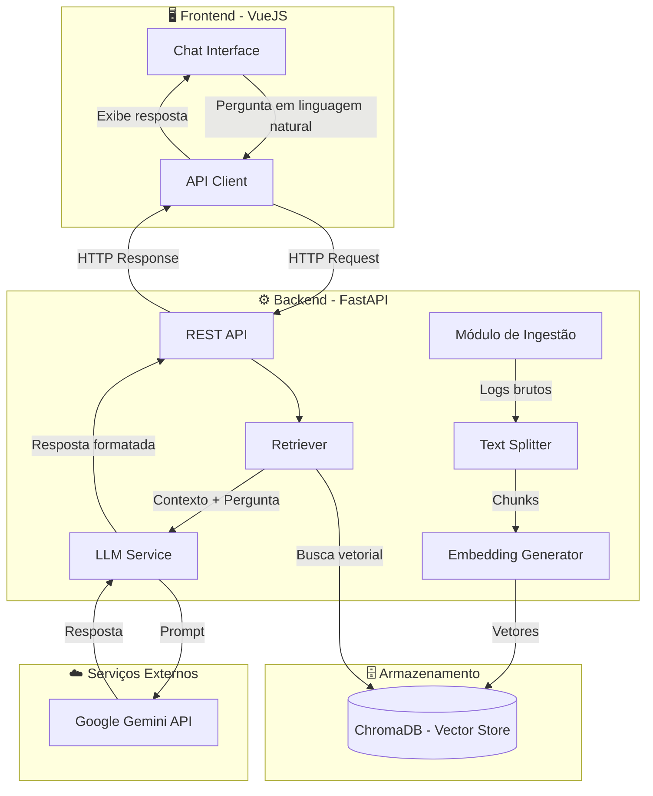
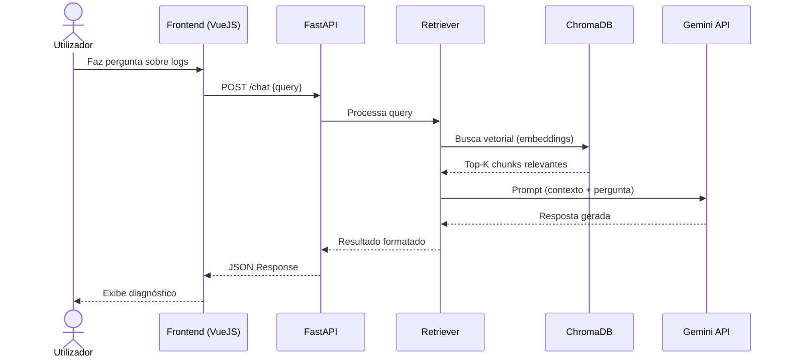
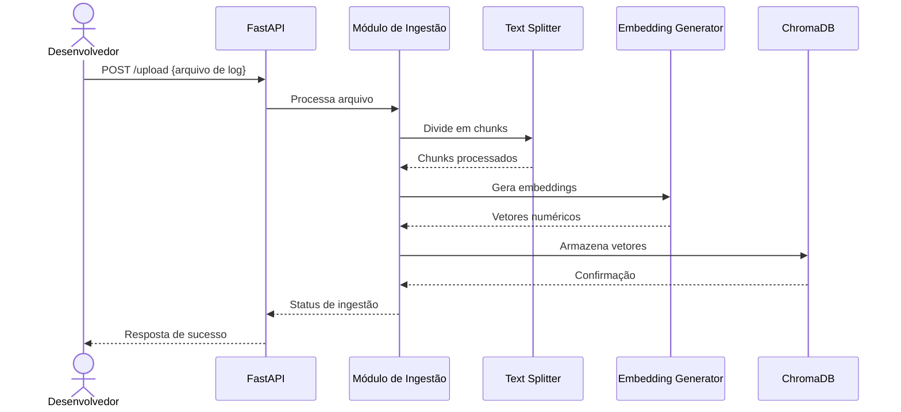

# 🤖 Semantic Log Explorer

O Semantic Log Explorer é uma ferramenta de observabilidade inteligente desenvolvida para simplificar o diagnóstico de falhas em sistemas complexos. Utilizando IA Generativa e arquitetura RAG (Retrieval-Augmented Generation), a aplicação permite que os programadores analisem montanhas de logs através de uma interface de chat em linguagem natural.

Este projeto foi concebido durante o curso de Inteligência Artificial Generativa para o SENAI, com foco em aumentar a produtividade e reduzir o MTTR (Mean Time To Repair) das equipas de desenvolvimento.

## 🚀 Funcionalidades

- Análise Semântica: Identifica erros não apenas por palavras-chave, mas pelo contexto e significado técnico.
- Diagnóstico de Causa Raiz: Explica detalhadamente o porquê de falhas como NullPointerException ou Timeouts de base de dados.
- Interface Conversacional: Chat interativo para interrogar logs estruturados (JSON) e não estruturados (TXT).
- Onboarding Acelerado: Ajuda novos programadores a compreenderem comportamentos de sistemas legados rapidamente.

## 🏗️ Arquitetura Técnica

O projeto utiliza um pipeline de RAG para garantir que a IA tenha acesso aos dados mais recentes e específicos do sistema:

- Ingestão: Os logs são carregados e divididos em chunks processáveis.
- Vetorização: Cada fragmento de log é transformado em vetores numéricos (embeddings).
- Armazenamento: Os vetores são guardados numa base de dados vetorial (ChromaDB).
- Recuperação & Resposta: Quando o utilizador faz uma pergunta, o sistema recupera os logs mais relevantes e envia-os como contexto para o LLM (Gemini 1.5 Pro / GPT-4) gerar a resposta.

## � Diagrama UML

### Diagrama de Componentes



### Diagrama de Sequência - Fluxo de Consulta



### Diagrama de Sequência - Fluxo de Ingestão de Logs



## 🛠️ Tecnologias Utilizadas

- Linguagem: Python 3.10+
- Package Manager: UV/NPM
- Framework de IA: LangChain / LlamaIndex
- Base de Dados Vetorial: ChromaDB
- LLM: Google Gemini API (ou OpenAI GPT-4)
- Frontend: VueJS
- Orquestração: FastAPI

## 📦 Como Instalar e Executar

Clonar o repositório:

```
git clone [https://github.com/seu-utilizador/semantic-log-explorer.git](https://github.com/seu-utilizador/semantic-log-explorer.git)
cd semantic-log-explorer
```

Configurar o ambiente virtual:

```
uv sync
```

Configurar Variáveis de Ambiente:
Crie um arquivo .env na pasta backend e adicione a sua chave de API:

```
GOOGLE_API_KEY=sua_chave_aqui
DATABASE_URL=seu_link_db
```

Executar a Aplicação:

```
cd backend
uv run uvicorn main:app --reload --host 0.0.0.0 --port 8000

cd frontend
npm install
npm run dev
```

## 💬 Exemplos de Uso

Uma vez que o sistema esteja a correr, pode fazer perguntas como:

"Explique a causa raiz do NullPointerException que ocorreu no módulo de pagamentos."

"Resuma os 3 erros mais frequentes das últimas 24 horas e sugira correções para cada um."

"Este erro de Timeout na base de dados está relacionado com algum outro serviço?"

## 👥 Equipe

- Josiel Eliseu Borges
- Luiz Antonio Roussenq
- Arthur Guerra Batista
- Barbara Haydée
- Caio Rodrigo Oliveira
- Caio Batista dos Santos