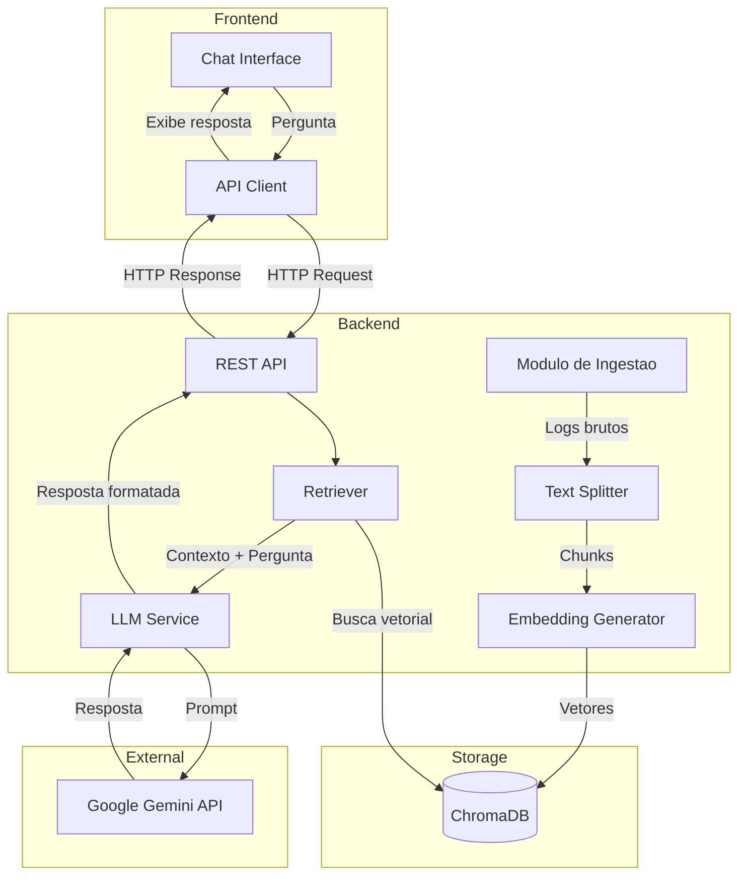
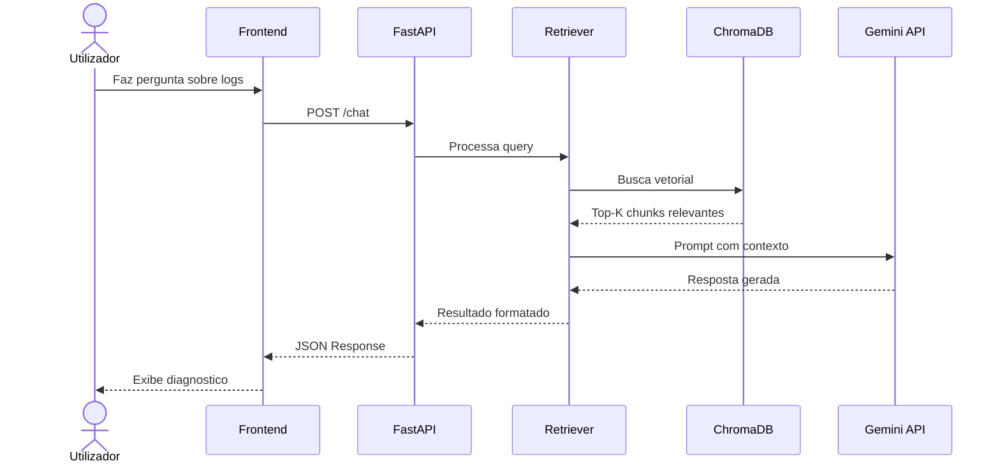
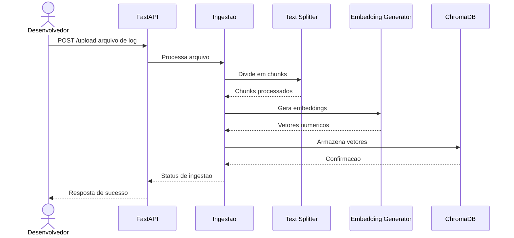

# 📐 Diagramas UML — Semantic Log Explorer

## Diagrama de Componentes

```mermaid
graph TB
    subgraph Frontend
        UI[Chat Interface]
        API_CLIENT[API Client]
    end

    subgraph Backend
        API[REST API]
        INGEST[Modulo de Ingestao]
        CHUNKER[Text Splitter]
        EMBEDDER[Embedding Generator]
        RETRIEVER[Retriever]
        LLM_SERVICE[LLM Service]
    end

    subgraph Storage
        CHROMADB[(ChromaDB)]
    end

    subgraph External
        GEMINI[Google Gemini API]
    end

    UI -->|Pergunta| API_CLIENT
    API_CLIENT -->|HTTP Request| API
    API --> RETRIEVER
    RETRIEVER -->|Busca vetorial| CHROMADB
    RETRIEVER -->|Contexto + Pergunta| LLM_SERVICE
    LLM_SERVICE -->|Prompt| GEMINI
    GEMINI -->|Resposta| LLM_SERVICE
    LLM_SERVICE -->|Resposta formatada| API
    API -->|HTTP Response| API_CLIENT
    API_CLIENT -->|Exibe resposta| UI

    INGEST -->|Logs brutos| CHUNKER
    CHUNKER -->|Chunks| EMBEDDER
    EMBEDDER -->|Vetores| CHROMADB
```

## Diagrama de Sequência — Fluxo de Consulta

```mermaid
sequenceDiagram
    actor User as Utilizador
    participant FE as Frontend
    participant API as FastAPI
    participant RET as Retriever
    participant DB as ChromaDB
    participant LLM as Gemini API

    User->>FE: Faz pergunta sobre logs
    FE->>API: POST /chat
    API->>RET: Processa query
    RET->>DB: Busca vetorial
    DB-->>RET: Top-K chunks relevantes
    RET->>LLM: Prompt com contexto
    LLM-->>RET: Resposta gerada
    RET-->>API: Resultado formatado
    API-->>FE: JSON Response
    FE-->>User: Exibe diagnostico
```

## Diagrama de Sequência — Fluxo de Ingestão de Logs

```mermaid
sequenceDiagram
    actor Dev as Desenvolvedor
    participant API as FastAPI
    participant ING as Ingestao
    participant SPL as Text Splitter
    participant EMB as Embedding Generator
    participant DB as ChromaDB

    Dev->>API: POST /upload arquivo de log
    API->>ING: Processa arquivo
    ING->>SPL: Divide em chunks
    SPL-->>ING: Chunks processados
    ING->>EMB: Gera embeddings
    EMB-->>ING: Vetores numericos
    ING->>DB: Armazena vetores
    DB-->>ING: Confirmacao
    ING-->>API: Status de ingestao
    API-->>Dev: Resposta de sucesso
```
